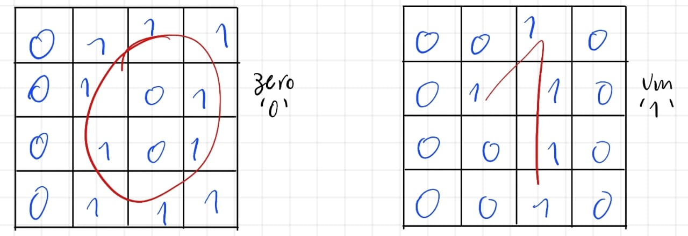

# Single Layer Perceptron ANN

Este projeto implementa uma rede neural Perceptron de camada única (_Single-Layer Perceptron_) para identificar dígitos cursivos 0 e 1. Os dígitos são representados em uma matriz 4x4, resultando em 16 pixels binários como entrada para a rede.

## 📁 Estrutura do Repositório

- `perceptron.py` - Código principal do projeto, contendo o treinamento e reconhecimento dos dígitos.
- `sinapses_final.txt` - Arquivo que armazena os pesos treinados após o processo de aprendizado.
- `amostras.txt` - Arquivo contendo exemplos de entrada para treinamento e teste.

## 🚀 Como Executar

### 1️⃣ Clonar o repositório

```bash
$ git clone https://github.com/Heverton-Souza/Single_layer-Perceptron-ANN.git

$ cd Single_layer-Perceptron-ANN
```

### 2️⃣ Instalar dependências

Este projeto utiliza a biblioteca `numpy`, que pode ser instalada com:

```bash
$ pip install numpy
```

### 3️⃣ Executar o código

Para iniciar o treinamento ou reconhecer dígitos, basta rodar o script:

```bash
$ python perceptron.py
```

O programa apresentará um menu:

1. **Treinar a rede neural** - Permite fornecer amostras e treinar a rede.
2. **Reconhecer um dígito** - Permite inserir uma nova amostra e testar a rede já treinada.
3. **Sair** - Finaliza o programa.

## 🧠 Como Funciona

### 🔹 Entrada de Dados

Cada amostra de treinamento ou teste é uma sequência de 16 valores binários representando uma matriz 4x4. Exemplo de entrada:

```
0 1 1 1 0 1 0 1 0 1 0 1 0 1 1 1 - Zero
0 1 0 0 1 1 0 0 0 1 0 0 1 1 0 0 - Um
```

A rede recebe esses valores como entrada, adicionando um bias.

### 🔹 Treinamento

O treinamento ocorre com um Perceptron de dois neurônios, cada um associado a uma classe (`0` ou `1`). O ajuste dos pesos é feito com a regra de aprendizado do Perceptron:

```math
W_{novo} = W_{atual} + TaxaDeAprendizado \times erro \times entrada
```

A condição de parada ocorre quando o erro médio quadrático atinge um limite predefinido.

Durante o treinamento, algumas informações sobre as atualizações dos pesos são exibidas no terminal. Exemplo de saída:

```
=== Época 5 ===

Treinando com amostra 1 (dígito [1. 0.])

Neuronio 0:
  v = 1.86, y = 1, erro = 0.0
  DeltaW: [0. 0. 0. 0. 0. 0. 0. 0. 0. 0. 0. 0. 0. 0. 0. 0. 0.]
  Novos pesos: [-0.50613628  1.66296697  2.24124522  1.47584254 -0.87120899  0.0532992
 -3.54614538 -2.28802013  0.36321573 -1.11362365  0.58368744  2.75120378
  2.26631375 -0.28551842  0.51624666  0.41552353 -1.07899735]

Neuronio 1:
  v = -2.46, y = 0, erro = 0.0
  DeltaW: [0. 0. 0. 0. 0. 0. 0. 0. 0. 0. 0. 0. 0. 0. 0. 0. 0.]
  Novos pesos: [ 1.70861063 -0.02720808 -0.64189102 -1.28024203 -0.48364429 -0.80908956
  1.05348833  1.46500914  0.4244675  -2.29967916 -0.01544823  0.49413873
 -1.23322367  1.14300559 -0.62332924 -0.76031105 -0.60477783]
```

### 🔹 Reconhecimento

Após o treinamento, novos dígitos podem ser classificados utilizando os pesos ajustados. O resultado indica se a amostra é reconhecida como `0` ou `1`.

## 📊 Testes e Taxa de Acerto

O arquivo `amostras.txt` contém exemplos usados no treinamento e teste:

- **Primeiras 8 amostras**: usadas no treinamento.
- **Últimas 8 amostras**: usadas para testar a rede após o treinamento.

Nos testes realizados com as 8 amostras que não foram usadas no treinamento, a rede acertou **5 de 8**, resultando em uma taxa de acerto de **62,5%**.

Os usuários podem inserir novas amostras digitando a matriz 4x4 manualmente no terminal.

## 📷 Visualizando os Dígitos

Para facilitar a compreensão, abaixo está um exemplo visual das representações dos dígitos nas matrizes 4x4:


